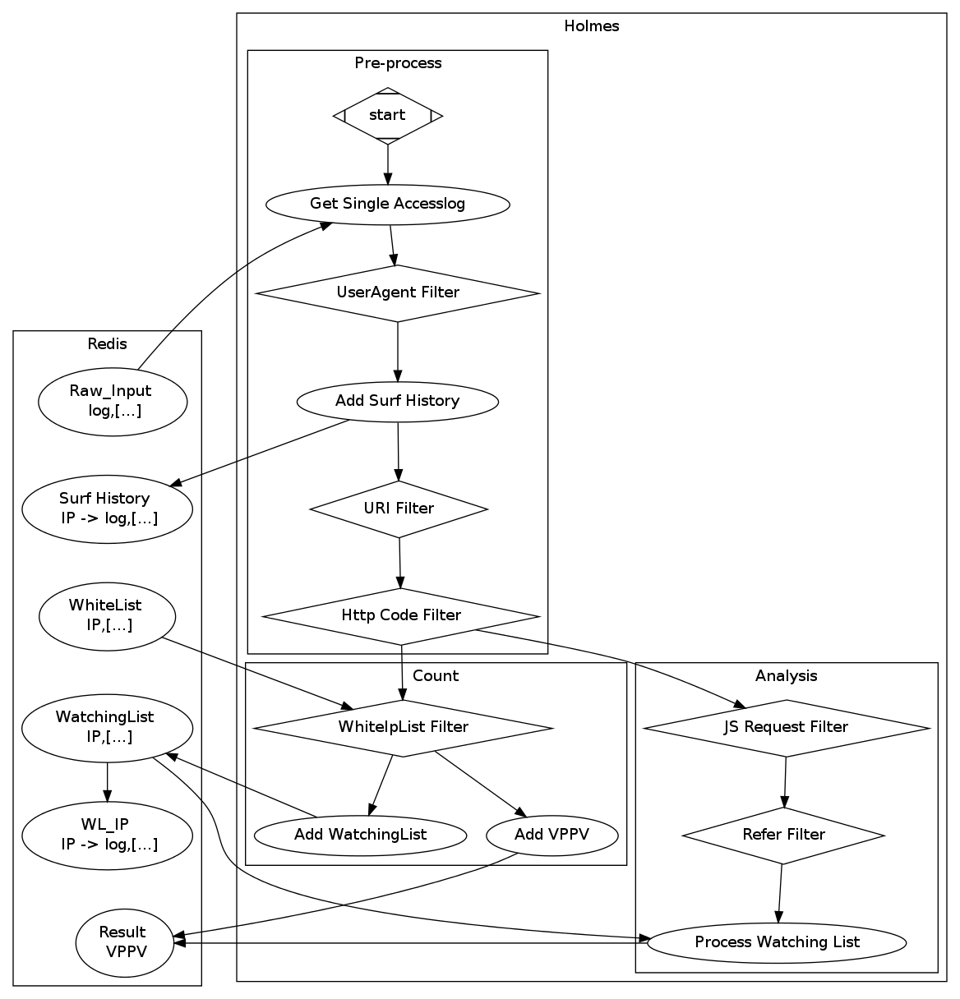
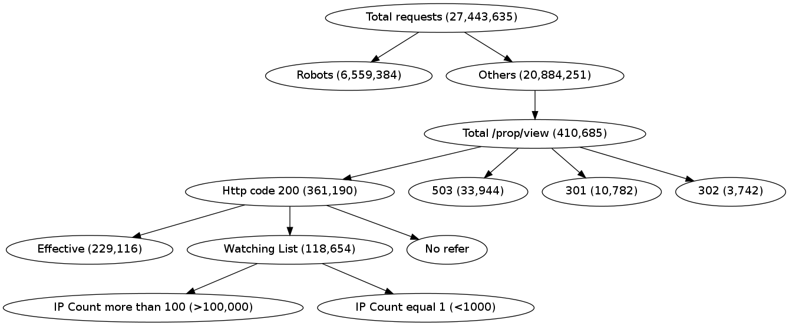

HOLMES
======================================
--------------------------------------
## Section 1: 背景

### 1.1 网络流量

如今主要有三种访问流量来源。

+ 用户
+ 正常搜索引擎的机器人
+ 非正常爬虫

对于用户，我们可以分为两类

+ 正常用户（需要计算在有效点击中）
+ 非正常用户（恶意点击等）

### 1.2 对公司意味着什么

+ 用户：高优先级，快速响应
 + 正常用户：有效点击
 + 恶意用户：无效点击，其他规则
+ 正常机器人：中优先级，合理响应速度
+ 不正常爬虫：低优先级，拒绝服务等其他规则

### 1.3 与之前的方法对比

+ Javascript代码计数
 + 目前，我们是通过用户浏览器隐含行为来统计分析的。一段Javascript的代码嵌入在页面中，用户通过浏览器访问时，会执行这一段程序，而其他机器人或爬虫是不执行该程序的。由此我们可以区分出用户和爬虫。
 + 这种方法的缺点在于，代码的执行在用户端，不可避免的有信息丢失，或者有禁用Javascript脚本的用户，那么这种方法就失效了，统计的结果就会有偏差。

+ Accesslog日志分析
 + 我们希望通过分析Accesslog来获取分类结果。
 + 更全面的覆盖请求，不会有任何的结果丢失。
 + 可以分析出更多的信息，比如对爬虫的分类等。

### 1.4 意义

+ 更精准的有效点击（点击付费，据说可以买好多切糕）
+ 禁止竞争对手的爬虫
+ 保护客户的利益（防止恶意点击）

---------------------------

## Section 2: 输入输出

### 2.1 格式

我们是通过分析日志的方式

那就意味着：

+ 输入：单条记录r。其中，全体r组成集合R，IP相同的r1、r2..组成集合S
+ 输出：被打上标签的单条记录r+tag

### 2.2 Example

+ 输入：单条记录
 + 23	2013	28	59	103.0	103.0	xxx.xxx.xxx.xxx	xxx.xxx.xxx.xxx	XXX.XXX.com	GET	/abc/def/ghi	200	295	http://abc.def.ghi.com	Mozilla/5.0 (Windows NT 6.1; WOW64) AppleWebKit/537.1 (KHTML, like Gecko) Chrome/21.0.1180.89 Safari/537.1	0.03	-	xxx.xx.xxx.xxx	-	59	06	1482	80
+ 输出：单条记录+标签
 + (xxx.xxx.xxx.xxx, human)

------------------------------------------

## Section 3: 可能的方法

主要有三大类的方法

+ 句法分析
 + 单个字段的分析
 + uesr-agent的规则匹配
 + 多字段规则匹配
+ 流量模式分析
 + 字段+行为分析
 + 请求资源的行为分析
 + 请求频率分析
 + 请求路线分析
+ 机器学习
 + 决策树
 + 神经网络
 + 贝叶斯网络
 + 隐马尔科夫模型

--------------------------------------------

## Section 4: 我们的实现

 

### 4.1 通过关键字词分析（“bot”，“spider”）

通常，搜索引擎都会在user-agent字段标注自己是正常的爬虫

+ 例如
 + google：**Mozilla/5.0 (compatible; Googlebot/2.1; +http ://www.google.com/bot.html)**
 + baidu：**Mozilla/5.0 (compatible; Baiduspider/2.0; +http ://www.baidu.com/search/spider.html)**

通过这些分析，可以识别除一些正常的爬虫

### 4.2 通过user-agent识别出正常的用户

在4.1节，通过基本的方法可以识别出很多正常的爬虫。但是有很多爬虫并没有申明自己为**bot**或者**spider**

因此，我们将注意力转移到正常的浏览器。正常浏览器的数量较少，且user-agent字段的模式更为稳定。

+ 例如
 + Google Chrome： **Mozilla/5.0 (X11; Linux i686) AppleWebKit/537.36 (KHTML, like Gecko) Chrome/28.0.1500.71 Safari/537.36**
 + 通过4.1、4.2两个规则，可以将大部分申明自己为搜索引擎的网页爬虫识别出来。

### 4.3  通过访问资源的URI匹配

+ 鉴于我们感兴趣的只有部分访问，我们只需要对访问URI前缀为**/a/b/**的记录做分析。
+ 正则表达式为**^/a/b/**

### 4.4 HTTP Code选出成功的请求

+ 只有HTTP Code为2xx系列的请求为有效
+ 因此，使用正则表达式**^2**

--------------------------------------------

## Section 5: 结果

### 统计结果树(total request num   ->    effective click num)

### 对比图

### 分析

---------------------------------------------

## Section 6: 还可以做什么

+ 更多的规则
+ 更好的机器学习算法
+ 使用集群提高处理效率

+ 除了以上之外，还有其他用途
 + 禁止恶意点击，保护客户
 + 禁止竞争对手的爬虫，保护数据，节约资源

---------------------------------------------

## Section 7: 总结

---------------------------------------------
